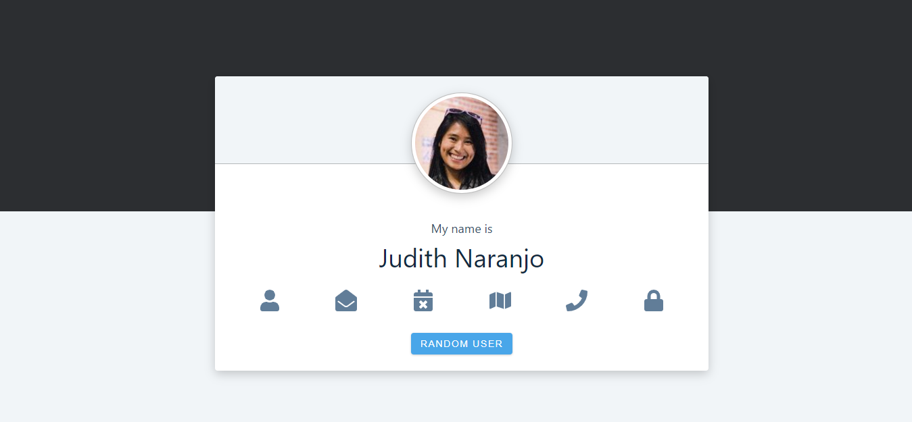

# Random Person Generator

Course exclusive project from [React Projects](https://react-projects.netlify.app/) by [John Smilga](https://github.com/john-smilga).

## Link

- [Project URL](https://random-person-generator-react.netlify.app) (hosted on Netlify)

## Screenshot

## Project

Users should be able to:

- See a random user
- Hover on the icons to see the user's information
- Click on the "random user" button to see a new random user

## Built with

- Semantic HTML5 markup
- CSS custom properties (provided by the course instructor)
- JavaScript
- React
- [Random User Generator API](https://randomuser.me/)

## Author

Chiara Stefanelli - Front-End Development Student based in Italy

- Website - [Chiara Stefanelli](https://chiarastefanelli.netlify.app/)
- LinkedIn - [Chiara Stefanelli](https://www.linkedin.com/in/chiarastefanelli/?locale=en_US)
